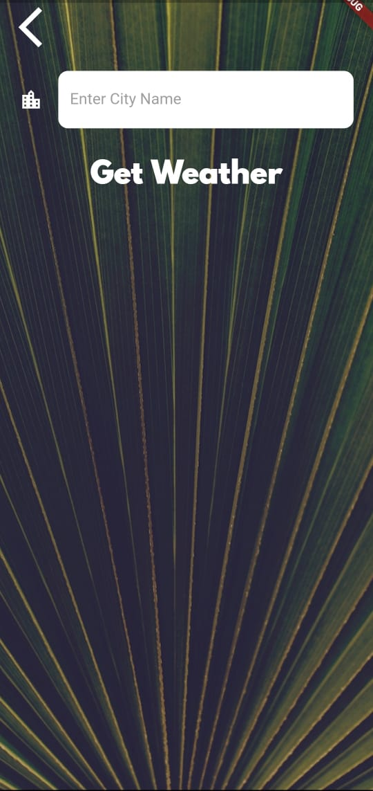
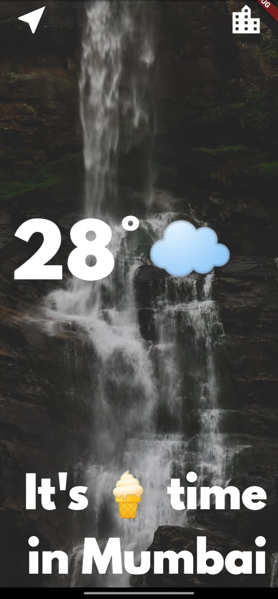

# Dew-The Weather App(Flutter-App)
<!--A web application for online classroom where you can create your own class or can join someone else's. An online Assignment creation / submission and Grading application. -->

- An application where user can track the weather conditions of its current location and also search for weather for any city fetched from the Open Weather API

## Setting up

    flutter pub get
    flutter run

### Screenshots of the project

#### Search and Result Page

